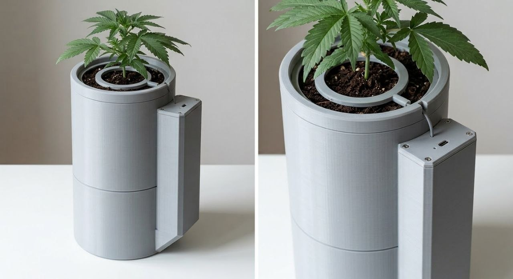
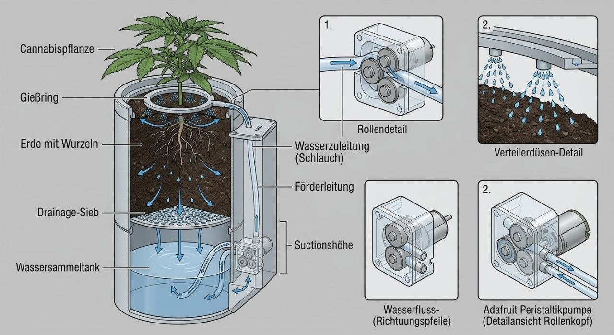

# Smart Grow Topf

Automatisch bewässernder Topf für eine Cannabis-Pflanze, gesteuert über ein **ESP32-C6-Modul direkt auf der eigenen PCB** (eigener 2S-Lader, eigene 5-V-/3,3-V-Wandler), Akkubetrieb. **Eigenes Projekt** (unabhängig vom GrowTower).



*KI-generiertes Konzeptbild (Prompts: [`docs/04_bildkonzepte-prompts.md`](docs/04_bildkonzepte-prompts.md)) — zeigt Wulst mit Deckel und USB-C, Verteilerring auf dem Substrat, Kragen. Keine CAD-Ableitung: verbindliche Maße stehen in [`docs/02_architektur-und-geometrie.md`](docs/02_architektur-und-geometrie.md).*

## Konzept (Top-Drip mit Rücklauf)



*KI-generiertes Funktionsbild (Prompt 3 aus [`docs/04_bildkonzepte-prompts.md`](docs/04_bildkonzepte-prompts.md)) — Weg des Wassers: Peristaltikpumpe in der Wulst → Druckleitung über den Kragen → Gießring → Tropfen ins Substrat → Drainage-Sieb → zurück in den Sammeltank. Bild und Beschriftung sind KI-generiert und nicht maßhaltig. Was im Bild fehlt: der kapazitive Sensor (bei r ≈ 55 mm, Messebene 75 mm tief) und die 25 mm Blähton-Drainageschicht über dem Sieb; „Suctionshöhe" ist ein KI-Sprachfehler (gemeint: Saughöhe). Verbindlich bleibt [`docs/02_architektur-und-geometrie.md`](docs/02_architektur-und-geometrie.md).*

```
        Verteilerring (3D-Druck)          ← Wasser von oben
   ┌──────────────────────────────┐
   │  ERDE / SUBSTRAT             │   Ø127 innen × 150 mm (≈1,6 L)
   │  ⊗ kapazitiver Sensor        │   Messebene 75 mm = halbe Topfhöhe
   │  ▒▒ Blähton 25 mm ▒▒         │   Dränage + Partikelfilter
   └──────────────┬───────────────┘
        Luftspalt 30 mm (Gießfüße)
   ┌──────────────┴───────────────┐
   │  WASSERTANK 1,0 L            │   Ø134 innen, max. 71 mm Wasserstand
   └──────────────────────────────┘
        Wulst seitlich: Pumpe, PCB (ESP32-C6-Modul), Akku, Schlauch-/Kabelkanal
```

**Gesamthöhe 278 mm**, Grundriss Ø 140 mm (mit Wulst ≈ 180 mm breit).

**Regelkreis:**
1. Kapazitiver Sensor (analog, **invertiert**: trocken = hoher ADC) misst die Substratfeuchte.
2. Zu trocken → **Pumpe EIN** (Peristaltik, Wasser von oben auf den Verteilerring).
3. Überschuss läuft durchs Substrat und zurück in den Tank.
4. **10–20 min** später erneut messen: ADC gefallen → ok. ADC nicht gefallen → **Tank leer / Pumpe verstopft** → Telegram-Alarm.

## Warum dieses Design
- **Peristaltik:** Medium bleibt im Schlauch, kommt nie mit der Pumpenmechanik in Kontakt → sauber, kleine Mengen, akkutauglich, selbstansaugend.
- **Top-Drip:** gezielte Dosierung von oben, kein dauerhaft wassergesättigter Topfboden (Luftspalt), Wurzeln bleiben belüftet.
- **Kapazitiver Sensor:** korrosionsfrei, analog direkt am ADC, Messebene in der Wurzelzone.
- **Wulst statt Innenraum:** Elektronik komplett über dem Wasserstand, Sensor/Kabel/Schlauch sauber geführt.

## Projektstruktur
```
cannabis-autopot/
├── README.md
├── docs/
│   ├── 01_anforderungen.md              ← Festlegungen des Users
│   ├── 02_architektur-und-geometrie.md  ← verbindliche Maße (CAD/PCB-Grundlage)
│   ├── 04_bildkonzepte-prompts.md       ← KI-Image-Prompts (+ generierte .txt)
│   └── img/                             ← KI-Konzeptbilder
├── scripts/
│   ├── check_netlist.py                 ← Lint der Netzliste (exit 0 vor dem Layout nötig)
│   └── check_bom_consistency.py         ← Querabgleich Schaltplan ↔ JLCPCB-BOM
├── hardware/
│   ├── design/                          ← Schaltplan als Python-Modell: 29 Prüfungen + Simulationen
│   │   └── MUTATIONSTEST.md             ← Nachweis, dass jede Prüfung bei Fehlern anschlägt
│   ├── bom_entscheidung.md              ← BESTELLGRUNDLAGE: Bauteile, Preise, Links
│   ├── schaltplan_v1.md                 ← VERBINDUNGSVORGABE: Netze, Werte, Pinbelegungen
│   ├── schaltplan_v1_netzliste.csv      ← dieselben Verbindungen maschinenlesbar (Netz, Bauteil, Pin)
│   ├── pcba_bom_jlc.csv                 ← BOM im JLCPCB-Upload-Format (LCSC-Codes)
│   ├── pcba_verfuegbarkeit_jlc.md       ← JLC-Verfügbarkeitsprüfung je Position
│   └── hardware_auswahl_bom.md          ← Recherche-/Ideenebene (nicht Bestellgrundlage)
├── research/
│   ├── bom-check/                       ← aktueller Preis-/Verfügbarkeitscheck je Bauteilgruppe
│   ├── kapazitiver-bodenfeuchtesensor-esp32-recherche.md
│   ├── smart-grow-topf_pumpe-bewaesserung.md
│   ├── smart-grow-topf-esp32-firmware-konzept.md
│   └── markt-konzept-recherche.md
└── cad/                                 ← parametrisches Gehäuse-CAD (build123d/Python)
    ├── params.py · lib.py                 ← alle Maße + Helfer
    ├── parts/*.py                         ← ein Modul je Druckteil (build/check)
    ├── assembly.py                        ← Baugruppe über RigidJoints
    └── export_all.py                      ← baut, prüft, exportiert STL + STEP
```

## Status
- [x] Projektordner + Anforderungen + 4 Recherchen (10.09.2026)
- [x] **Entscheidungen 11.09.2026:** Topf Ø140×150 (Erde) + 1 L Tank darunter · ESP32-C6-MINI-1 auf eigener PCB · Wulst mit Kanal · Top-Drip-Ring · Sensor von oben · Telegram final · nur Wasser
- [x] **Höhen-/Volumenberechnung** → Gesamthöhe 278 mm, Tank 1,0 L, Erdvolumen 1,9 L (`docs/02_...`)
- [x] **BOM-Entscheidung** (11.09.2026, Pumpentausch 14.09.2026): ESP32-C6-MINI-1 ≈ 3,60 € · Peristaltikpumpe **CONQUERALL DC 5 V** (Amazon `B0DHVMZ27Y`, ≤150 ml/min, 3 × 5 mm Schlauch) **11,99 €** statt 31,94 € OEM · Sensor v1.2 4,99 € · EFASO-Akku 14,90 € → **≈ 47–49 €** gesamt inkl. Schlauch und Passiven (+ ~28 € JLCPCB-Handling) (`hardware/bom_entscheidung.md`)
- [x] **Versorgung festgelegt (Revision „2S-Umbau\", 16.09.2026):** **2S-Pack 6,0–8,4 V** an J1, **3-polig (B− / Mittelabgriff / B+)** — **Zellschutz (HY2120) und Balancing (IP2326) sitzen auf unserer Platine** · Lader **IP2326** (2S-Boost-Lader aus 5 V USB, 8,4 V / 0,90 A) · **U_BUCK5 SY8113B** → **+5V (5,10 V)** für beide Pumpen und den neuen 5-V-Ausgang J17 · **U_BUCK3 AP63203** → **+3V3 (3,31 V)** für die Logik · Wächter **TPS3839G33** (Auslösung bei 6,16 V Pack). Ersetzt 1S-Akku, MCP73831, ME6211, MAX809 und den MT3608-Boost. ⚠️ **Offen:** der 3-A-Pumpenanlauf liegt zwar am Nennstrom des 5-V-Bucks, aber nur **0,57 A unter dem Isat (4,0 A)** der 4,7-µH-Induktivität → **PWM-Softstart weiter empfohlen**, Messauftrag in `docs/11_review-2s-umbau.md` §8 und `hardware/schaltplan_v1.md` §6.7
- [x] **PCBA geprüft (16.09.2026):** alle Bauteile bei JLCPCB verfügbar (LCSC-Codes in `hardware/pcba_bom_jlc.csv`; **109 bestückte Refs**, davon **17 Extended-Positionen ≈ 51 USD Handling** — `hardware/pcba_verfuegbarkeit_jlc.md` §1b)
- [x] **Sauerstoffpumpe + 5-V-Boost** (15.09.2026): **zweiter** Pumpenpfad — **Q3** (AO3400A) mit
      **R33/R34**, Freilauf **D7**, UV-Klemmzweig **D8**, Stecker **J16** (JST-XH 2P aufrecht, gleicher
      Typ wie J4) an **IO22** (vorher Reserve **J14** ⛔ entfällt). Damit **beide** Pumpen 5 V bekommen,
      erzeugt **U8 MT3608** mit **L1 22 µH**, **D6 SS34**, **C17/C18 22 µF**, **R31 75 kΩ/R32 10 kΩ**
      eine geregelte **+5-V-Schiene (5,10 V)** aus VBAT; J4 Pin 1 und D1 liegen jetzt an **+5V**.
      ⚠️ Zwei Folgepflichten: **PWM-Softstart jetzt Pflicht** (der Boost liefert den 3-A-Anlauf nicht —
      22 µF ≈ 7 µs) und **O2-Pumpe nicht dauerhaft** (1500-mAh-Zelle wäre in ~2,5 h leer).
      Rechnungen + offene Punkte (Platz!, Einbauort außerhalb) in `hardware/schaltplan_v1.md` §10
- [x] **Sauerstoffpumpe ausgewählt** (15.09.2026): **Mini USB Aquarium-Luftpumpe mit Luftstein**,
      Amazon **`B0FXB5BMTT`, 8,48 €** — **5 V USB**, ~1 W (**0,20 A**; aus der Zelle ≈ 0,32 A),
      < 35 dB, für 10–40 L, **Lieferumfang: Pumpe + 1,15 m Silikonschlauch + Luftsprudler**.
      Pumpe am **5-V-Boost** also unkritisch (Boost kann 1 A); Anschluss: USB-Stecker ab, rot/schwarz
      auf **JST-XH 2P (J16)**; Rückschlagventil in die Luftleitung; **außerhalb** des Topfs montieren
      (Membranpumpe braucht Frischluft). Alternativen: `B093GPMT1Z` (9,99 €, 210 L/h),
      `B0B82JX6Z4` (7,29 €, regelbar). Vergleichstabelle + Strom-/Laufzeitrechnung:
      `hardware/bom_entscheidung.md` §8
- [x] **Stecker auf „nach oben" umgestellt** (15.09.2026): J1/J2/J4 von gewinkelt (Side-Entry) auf
      **aufrecht (Top-Entry)** — neue LCSC-Codes `C160352` (Akku PH, SMD), `C493416` (Sensor XH-3P),
      `C158012` (Pumpe XH-2P); vorher `C54582899`/`C157928`/`C157931`. Die aufrechten Typen haben
      deutlich mehr Lager (u. a. J4: 203.889 statt 2). Elektrik unverändert (**Pin-Diff = 0, 50 Netze**),
      PCB per `import-changes` als **„Modify Footprint"** aktualisiert (80 Bauteile, **Platzierung erhalten**)
- [x] **Schaltplan V1 + Netzliste** (`hardware/schaltplan_v1.md`, `..._netzliste.csv`, **68 Netze / 115 Bauteile / 314 Verbindungen / 109 bestückte Positionen**)
- [x] **Design als Python-Modell + Prüfungen** (`hardware/design/`): **29** Design-Regelprüfungen gegen die
      Datenblattgrenzen, 6 Simulationsgruppen, Mutationsabdeckung vollständig (`hardware/design/MUTATIONSTEST.md`)
- [x] **Taster + 3 LEDs** (11.09.2026): externer Nachfüll-Taster an IO6 (weckt aus dem Deep-Sleep), nur
      2 Lötpads auf der Platine · **D5 rot = Tank leer** (IO7, R_TANK 1 kΩ, Firmware blinkt) ·
      **D2 grün = Status** (IO14, C2297, R4 **220 Ω** — grün hat Vf 2,85 V, am 3,3-V-Rail bleiben nur 0,45 V
      Reserve) · D_LEDCHG rot = Ladestatus. Neue Positionen sind **basic** (kein Extended-Aufpreis)
- [x] **Lichtsensor extern + Licht-Gate** (13.09.2026): Bewässerung nur in der Dunkelphase.
      Stecker **J7** (seit 14.09.2026 2,54-mm-Stiftleiste) mit **R_LIGHT 10 kΩ** (offener Stecker
      ⇒ 0 V ⇒ „dunkel", Bewässerung bleibt erlaubt) · **R_LIGHT_S 1 kΩ** + **C_LIGHT 100 nF** am
      ADC · Sensor an **SENSOR_PWR** (geschaltet, keine Standby-Verschlechterung) · ADC auf
      **IO4 (ADC1_CH4)**. Firmware-Fail-safe inkl. Zeitfenster-Fallback und Telegram-Alarm.
      **Pin-Korrektur:** IO4/IO5 sind keine boot-kritischen Strapping-Pins (nur GPIO8/9/15).
- [x] **Pinordnung GND–VCC–SIG** (13.09.2026): alle 3-poligen Stecker auf
      1 = GND · **2 = VCC** · 3 = Signal (nur der mittlere Pin ist gegen Umdrehen invariant — ein
      verkehrt gesteckter Stecker kann so **nie** 3,3 V auf einen MCU-Pin legen). J8 (I²C 4-pol)
      als **GND–VCC_EXT–SDA–SCL**.
- [x] **GPIO-Erweiterung auf 2,54-mm-Stiftleisten** (14.09.2026): alle freien GPIOs + I²C als
      **Stiftleisten (male, gerade)** für Dupont-Buchsen — **je Signal ein eigener 3-pol Stecker**
      (**J9–J15**: IO5/IO15/IO16/IO17/IO21/IO22/IO23), I²C als 4-pol **J8**, Lichtsensor **J7** jetzt
      ebenfalls Stiftleiste. **1 kΩ in Reihe in jeder Signalleitung**. Erweiterungsversorgung
      **VCC_EXT** über **P-Kanal-Load-Switch Q2 (AO3401A)**: Gate über 47 kΩ auf +3V3 ⇒ **aus beim
      Reset** (Fail-safe). **I²C-Pull-ups an VCC_EXT** (kein Busstrom im Aus-Zustand). **C_SPARE**
      100 nF am Reserve-ADC. Offline-Generatoren: 80 Bauteile / 50 Netze / 233 Verbindungen,
      `check_ir_netlist.py` 0 Abweichungen; Live-Neuaufbau des EasyEDA-Blatts steht aus.
- [x] **Gehäuse-CAD parametrisch in build123d** (`cad/`, 14.09.2026): 8 Druckteile + Baugruppe, alle Teile gegen die OpenSCAD-Vorlage geprüft (±0,4 % Volumen, bbox ≤ 0,04 mm), Druckteile als STL + STEP exportierbar
- [ ] Firmware (State-Machine)

## Nächste Schritte
1. BOM finalisieren (Preise, Links, Verfügbarkeit) → `research/bom-check/`
2. Gehäuse-CAD (build123d, `cad/`) aus `docs/02_architektur-und-geometrie.md` — fertig, Teile drucken
3. PCB: ESP32-C6-Modul, IP2326-2S-Lader, SY8113B-Buck (5 V), AP63203-Buck (3,3 V), TPS3839-Wächter, MOSFET-Treiber, Sensor-ADC, USB-C, Taster-Lötpads, 3 LEDs — Netzliste `hardware/schaltplan_v1_netzliste.csv`
4. Firmware: State-Machine, Kalibrierroutine, Telegram-Alarm
